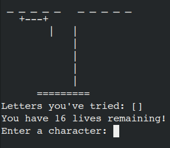

# Hangman 
#### Written by Dean Raguso

## Description
A classic Hangman game built in Ruby. 

## Features
- Menu screen upon game entrance.
- Options for chosing length of word.
- Options for chosing theme of word, powered through the Datamuse API.
- Score counter.

## Future Improvements
- More dynamic hangman animation.
- Refinement of word theme, to get more noun like return.
- Script file or executable for easier startup.

## Issues
 - Word theme may not change off of "goth" on occassion.

 

                                         /   .                               
                                        *%,..%%                      
                                        ,#.*##%%#                    
                                        #%%(.,...,%*                   
                                        %%,*#%%%%##                    
                                        %%,.....,%%                    
                                        (#%%%#%,,/#.                   
                                        %#.....#%##                    
                                        %%%%,,*%%%                    
                                        #%.*%..*#..%%                  
                                        %#..,*%.,*%...,%#                
                                    *%/..,%%%%*#%##,.,#%               
                                    %#...%#        .#(..,%#             
                                    #%..,#%           #%,.,%/            
                                    ##..(#             #*..%#            
                                    %%,./#            *%...%#            
                                    *#,,.%%           #(..*#             
                                    /%*..,%%.     ,%#,..(#,             
                                        %%,..,,##%%(....*#%               
                                        *#%#,,.,..,%%#. 